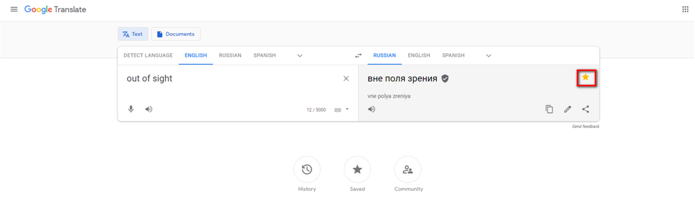
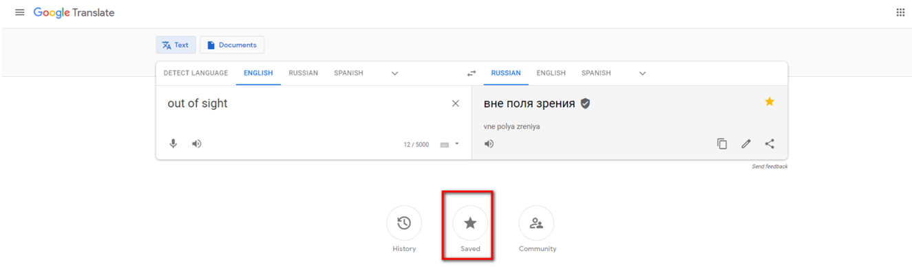
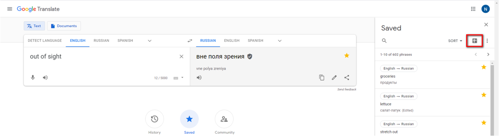
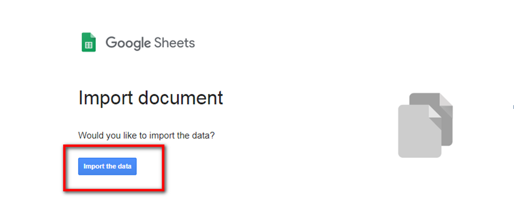
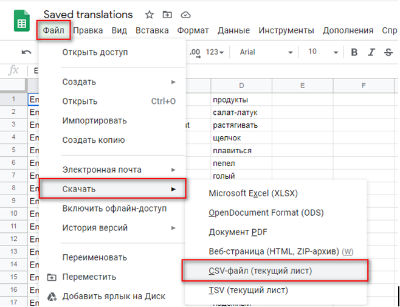

# EnglishWhale
This is desktop application which help you to increase English vocabulary , with google translate. You can add words and phrases in favorites on google translate page, and than export your saved words into a Google Tables. Now you can use csv file with words as input for application.

<H2 align="center">Step 1</H2>

1. Open Google Translate
2. Enter a word or phrase which you want to learn.
3. Add this word/phrase in "Saved" list by clicking the star in the right corner.

4. After adding all needed words/phrases in "Saved" move to the next step.

<H2 align="center">Step 2</H2>
1. Click "Saved" circle of the page bottom.

2. Then click export to Google Sheets.

3. Accept importing for Google Sheets.

<H2 align="center">Step 3</H2>
1. Download your words as a CSV file.

2. Use this CSV as an input for EnglishWhale.
